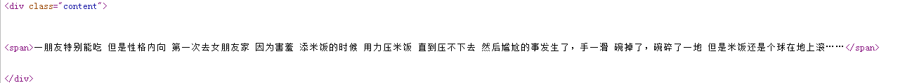
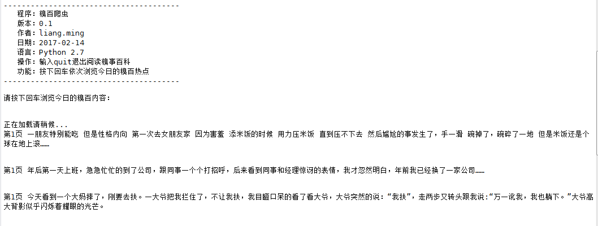

# Crawler_Qiubai

####项目内容：
用python写的一个简单的糗事百科段子爬取程序
####使用方法：
双击运行
####原理解析：
首先，先浏览一下糗事百科的主页：http://www.qiushibaike.com/text/page/1
可以看出来，链接中page/后面的数字就是对应的页码，记住这一点为以后的编写做准备。
然后，右击查看页面源码：

观察发现，每一个段子都用span标记，我们只需要用正则表达式将其“扣”出来就可以了。
####效果展示：
